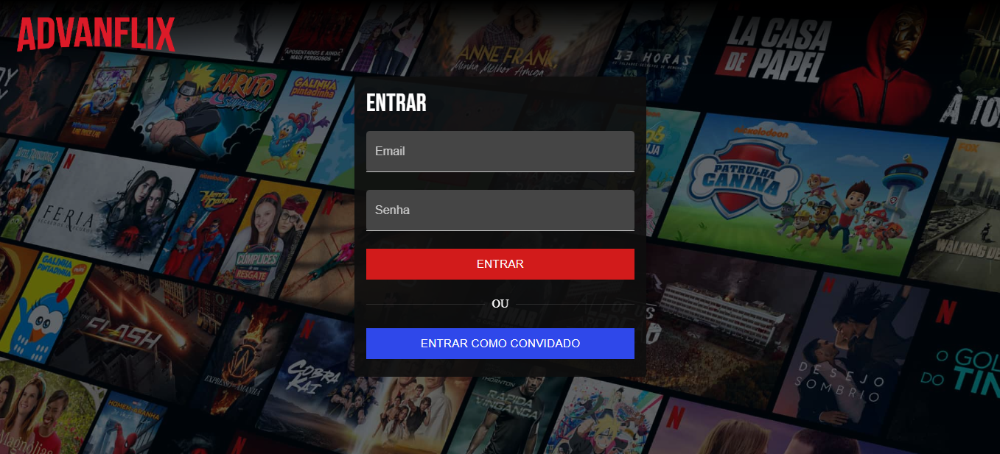
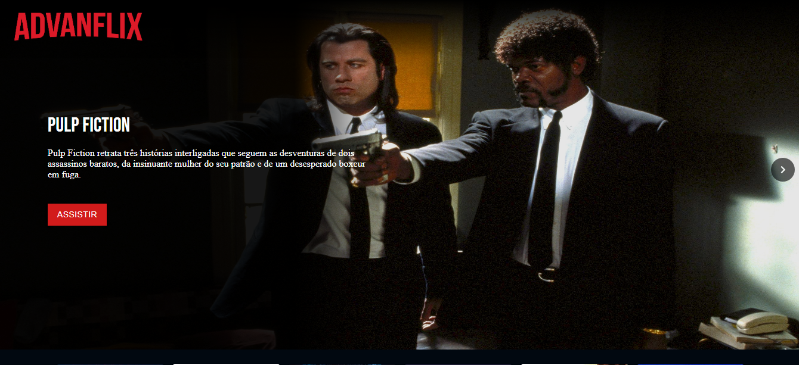
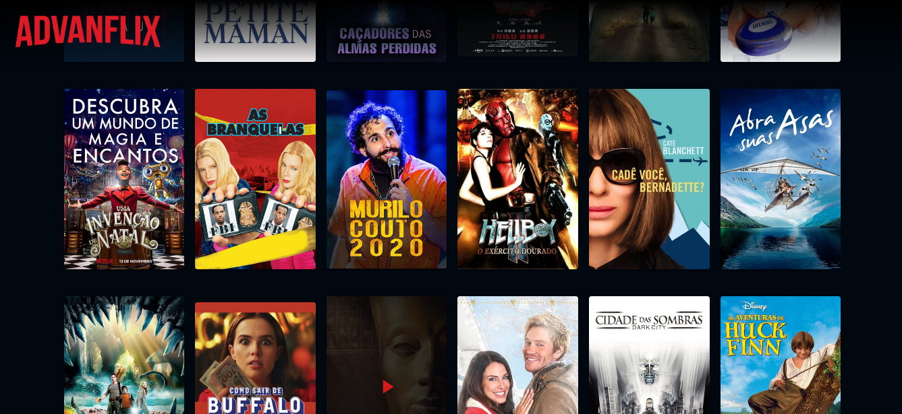

# AdvanFlix
Advanflix é um projeto de canais de Tv, Filmes e series com layout que lembra muito a [Netflix](https://www.netflix.com/).</br>
o projeto foi criado com intuito de estudar e desenvolver minhas habilitades tanto front-end quanto back-end contendo duas pastas inicias
uma para o servidor e outra para consumir o site.
Atualmente o projeto aceita sincronizar seus dados com uma playlist no formato m3u recebida atravez da web.

### Tecnologias utilizadas
#### Linguagens e Frameworks
> 
> 
> 
> 
> 
> 
> 
> 
> 
> 


#### Apis externas
- [](https://api.themoviedb.org)


### O projeto
O projeto é um aglomerado de ferramentas relacionadas a midia, tendo uma area para super usuarios (usuarios com perfil administrativo) com dashboard para controle  do conteudo, onde usuarios comuns não tem acesso, e tambem, uma tela onde os usuarios comuns podem assistir seus canais, filmes e series.

#### Screenshots do projeto.





# Baixar o projeto e dependencias
Para iniciar todo processo, precisamos baixa-lo  e para isso você precisa ter o git em seu computador </br>
o processo de instalação do git você pode acompanhar atraveze desse link [Instalar Git](https://git-scm.com/download)</br>
Tambem se faz necessario a instalação do node.js
[Instalar Node.js](https://nodejs.org)</br>
após realizar a instalação dos mesmo podemos clonar o projeto atravez do comando.</br>
```git clone https://github.com/Advansoftware/AdvanFlix.git```

## Back-end - Server

## Front-End - Web

No projeto o usuario pode entrar tanto como convidado ou com seu usuario e senha.</br>
apos a entrada no projeto o usuario poderá assistir seu conteudo a vontade.

### Instalando e rodando o Front-End
Apos ter realizado todo processo acima, pricisamos instalar e rodar o nosso projeto web </br>
para instalar o projeto, é necessario entrar na pasta do projeto e abrir o terminal
>Advanflix / web

e rodar o seguinte comando</br>

```npm install```</br>

apos realizar a instalação do projeto podemos iniciar o projeto rodando  o comando</br>

```npm start```

logo vai abrir o projeto front-end no seguinte endereço [http://localhost:3000](http://localhost:3000) porem ele depende do servidor para funcionar


# Demostração do projeto
## [https://advansoftware.web.app](https://advansoftware.web.app/)
